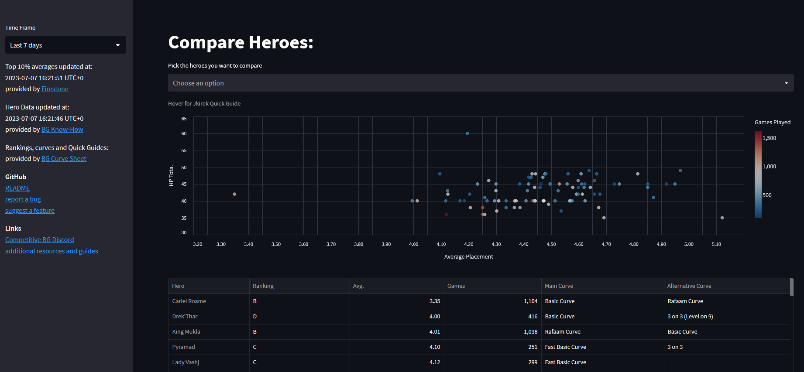

# HSBG: average placement per hero
This repo hosts a small streamlit app that shows average placements per Hero in the relation to their total HP in the game 
Hearthstone Battlegrounds.

<!-- The app is published on ... -->

Averages are provided by the [Firestone](https://www.firestoneapp.com/) API 
for Top 10% of Firestone users. 
The hero information (Name, Armor Tier) is provided by [BG Know-How](https://bgknowhow.com). 
Additional helpful information is provided by [Battlegrounds Curve Sheet](https://www.bgcurvesheet.com)

The Firestone averages are available for three time frames. The **current patch**, the **last 7 days** and 
the **last 3 days**. 

Each time frame is cached by the app individually for 6 hours.  
The BG Know-How hero data is also cached for 6 hours.  
If the cache time is overdue, data will only be re-requested from the APIs when the app is actively accessed by a user. 
*Please note: Even though the data might be re-requested in certain intervals, it does not necessarily mean, that the 
underlying API result changes.*

The time of the last API access is shown on the sidebar. 
