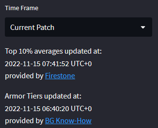

# HSBG: average placement per armor tier
This repo hosts a small streamlit app that shows average placements per Armor Tier in the game 
Hearthstone Battlegrounds.

The app is published on https://tranred-armor-tiers.streamlit.app

Averages are calculated from the placement distribution provided by the [Firestone](https://www.firestoneapp.com/) API 
for Top 10% of Firestone users. 
The hero information (Name, Armor Tier) is provided by [BG Know-How](https://bgknowhow.com).
Additional helpful information is provided by [Battlegrounds Curve Sheet](https://www.bgcurvesheet.com)

The Firestone averages are available for three time frames. The **current patch**, the **last 7 days** and 
the **last 3 days**. 

Each time frame is cached by the app individually for 6 hours.  
The BG Know-How hero data is also cached for 6 hours.  
If the cache time is overdue, data will only be re-requested from the APIs when the app is actively accessed by a user. 
*Please note: Even though the data might be re-requested in certain intervals, it does not necessarily mean, that the 
underlying API result changes.*

The time of the last API access is shown on the sidebar. 

## Calculations
### Average (per Hero)
For each hero the [Firestone](https://www.firestoneapp.com/) API returns a count for each result that happened 
(1st - 8th place) and a number of total games recorded for that hero. To calculate the average,
each placement will be multiplied with its count. The sum of all placements is divided by the number of total games.

| Placement | Count | Placement * Count |
|----------:|------:|------------------:|
|         1 |     1 |                 1 | 
|         2 |     2 |                 4 |
|         3 |     0 |                 0 |
|         4 |     4 |                16 |
|         5 |     0 |                 0 |
|         6 |     0 |                 0 |
|         7 |     2 |                14 |
|         8 |     1 |                 8 |
| **Total** |    10 |                43 |

**Average = 43 / 10 = 4.3**

### Weighted average (per Amor Tier)
The weighted average per armor tier is calculated by weighing individual hero averages with the number of games 
recorded with them. The more games were played with a certain hero, 
the more important their individual average becomes for the total.

**Example A:** 
High win-rate heroes have a noticeable high pick-rate. 
**=>** the weighted average will gravitate towards the lower end.

| Placement | Average | Games Played | Average * Games Played / Total Games |
|-----------|--------:|-------------:|-------------------------------------:|
| Hero A    |     3.9 |           40 |                   = 156 / 100 = 1.56 |
| Hero B    |     4.1 |           25 |                = 102.5 / 100 = 1.025 |
| Hero C    |     4.5 |           20 |                 = 67.5 / 100 = 0.675 |
| Hero D    |     4.5 |           10 |                    = 45 / 100 = 0.45 |
| Hero E    |     5.0 |           10 |                     = 40 / 100 = 0.5 |
| **Total** |       - |      **100** |                             **4.21** |

**Example B:** 
Heroes with medium results have the highest pick-rates. 
**=>** the weighted average will gravitate towards the middle.

| Placement | Average | Games Played | Average * Games Played / Total Games |
|-----------|--------:|-------------:|-------------------------------------:|
| Hero A    |     3.9 |           20 |                    = 78 / 100 = 0.78 |
| Hero B    |     4.1 |           10 |                    = 41 / 100 = 0.41 |
| Hero C    |     4.5 |           30 |                   = 135 / 100 = 1.35 |
| Hero D    |     4.5 |           36 |                   = 162 / 100 = 1.62 |
| Hero E    |     5.0 |            4 |                     = 20 / 100 = 0.2 |
| **Total** |       - |      **100** |                             **4.36** |

*The mean for the example data is 4.4 and the median is 4.5*
