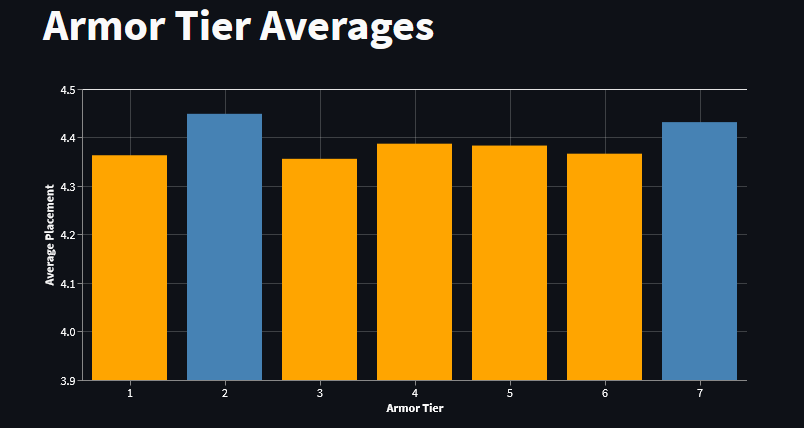
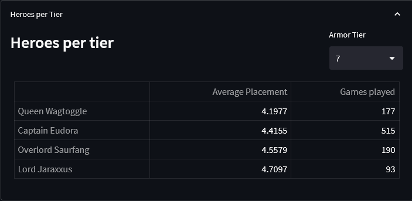
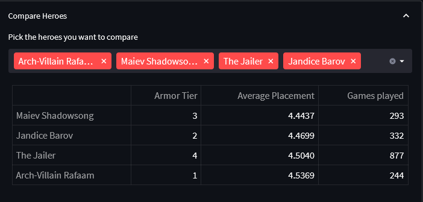

# HSBG: average placement per armor tier
This repo hosts a small streamlit app that shows average placements per Armor Tier in the game Hearthstone Battlegrounds.

The app is published on https://tranred-armor-tiers.streamlit.app

Averages are calculated from the placement distribution provided by the [Firestone](https://www.firestoneapp.com/) API for Top 10% of Firestone Users. The Armor Tier information is provided by the [BG Know-How](https://bgknowhow.com).

The Firestone averages are available for three time frames. The current patch, the last 7 days and the last 3 days. The option **Current Patch** returns the same averages as used in the [BG Curvesheet](https://www.bgcurvesheet.com).
Each time frame is cached by the app individually for 30 minutes.The BG Know-How hero data is cached for 2 hours.
If the cache time is overdue, data will only be re-requested from the APIs when the app is actually used by a user.
*Please note: Even though the data might be re-requested in certain intervals, it does not necessarily mean, that the underlying API result changes.*
The time of the last API access is shown on the sidebar.

The first section shows a graph with a weighted average per tier.
The yellow bars are tiers that are below the mean of all tiers. The blue ones are above it.

The second section, "Heroes per Tier" shows the hero data for a certain tier, that lead to the weighted average in the chart.

In the last section "Compare Heroes", all heroes are compared across tiers. With the search you can select only certain heroes you want to compare, i.e. for the hero selection at the start of your match.

